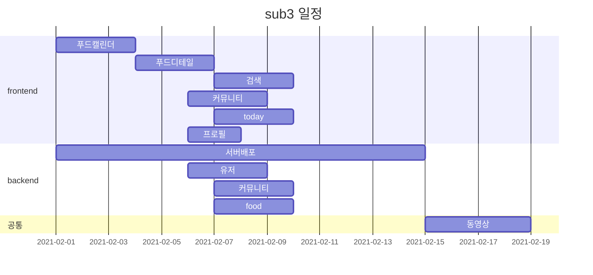

# 시연영상

https://youtu.be/9tAb53YVwNU

## 🥄 MOMOGO

- 팀명 : 모모고

- 팀원 소개

  - 팀장:  김병수
  - 팀원:  이호석, 이현우, 박성준, 최주아(QA)

  

### 주제

- 프로젝트 명:  
- 먹은 것을 기록하고 일일 영양소 체크와 식단 기록을 확인할 수 있는 서비스!

### 기술 스택

- Frontend
  - Vue.js 
- Backend
  - django

### 기능

- 음식 영양소 비교
- 음식 추천
- 음식 검색 기능

### ✔ 개발 규칙

#### Branch 규칙

-  master -> develop -> feature/fe/이름 , feature/be/이름
-  이름: 자기가정한 영어이름 ( 한번정한거 끝까지 )

  

#### merge

- 코드 리뷰후 merge 
- merge후 branch 삭제

#### commit

- git commit -m 'fe(be) / JIRA STORY / 진행상황'

